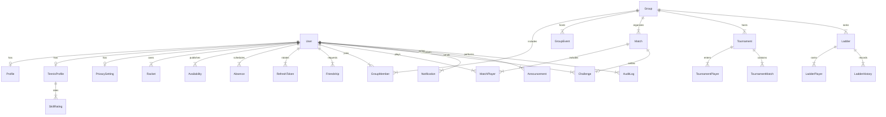

# Kort — system architecture

Kort is a mobile-first club app for a 30–100 member tennis club. The web client and the API are separate deployments. Phase 1 delivers identity, profiles, availability, search, groups, challenges, and matches. Phase 2 adds announcements, in-app notifications, tournament draws (knockout, round robin, group plus knockout, Americano), and ladder challenge rules on the same database. Phase 3 adds a server-filtered activity feed, set and game stats with head-to-head, an offline app shell, an `.ics` calendar download, manager-only club analytics, and plain-language match suggestions. Live deploy, email delivery, and push outside the app stay later.

## Deployments

| Piece | Runtime | Host |
| --- | --- | --- |
| `apps/web` | Next.js | Vercel |
| `apps/api` | Fastify | Railway |
| PostgreSQL | Prisma | Railway Postgres |

The browser talks only to the Next.js origin. A backend-for-frontend (BFF) under `apps/web/src/app/api` stores short-lived access tokens and rotating refresh tokens in httpOnly cookies on the web domain and calls the API with `Authorization: Bearer`. Tokens never go into `localStorage`.

Direct browser-to-API cookies were rejected for production: Vercel and Railway are different sites, and third-party cookies are unreliable. The API still accepts Bearer tokens (and can set its own cookies) so tests and server-to-server calls stay simple. CORS on the API allows only `WEB_ORIGIN`.

## Repository

```
apps/web          Next.js App Router, Turkish UI, PWA
apps/api          Fastify REST API, Prisma, auth, domain services
packages/shared   Zod schemas, labels, constants
packages/types    Shared response types
packages/ui       Brand tokens (visual primitives live in apps/web)
```

Web never imports Prisma. All reads and writes go through the REST API.

## Request path

1. UI calls `/api/bff/...` or `/api/session/*` (login, register, logout).
2. BFF attaches the access token. On 401 it rotates the refresh token once and retries.
3. API validates with Zod, authenticates, then authorizes by role.
4. Privacy filtering happens in the serializer before the response is sent.

## Auth and authorization

Authentication (who you are) and authorization (what you may do) are separate.

- Passwords hashed with argon2id.
- Access JWT, 15 minutes, signed with `ACCESS_TOKEN_SECRET`.
- Refresh token: random 32 bytes, only the SHA-256 hash is stored. Rotation keeps a family id. Reuse of a revoked token revokes the whole family.
- Every authenticated request reloads the user so role changes and soft-deletes apply immediately.

| Role | Scope |
| --- | --- |
| ADMIN | Entire system, including privacy override (audit logged) |
| CLUB_MANAGER | Members, groups, tournaments, announcements. Privacy override is audit logged |
| TOURNAMENT_MANAGER | Create tournaments and register players. Bracket engine is Phase 2 |
| GROUP_MANAGER | Only groups where that user is a group manager |
| MEMBER | Own profile, availability, challenges, matches, tennis info |

## Module boundaries

| Module | Phase 1 | Later |
| --- | --- | --- |
| Identity & profiles | Full | — |
| Tennis profile & rackets | Full | — |
| Availability | Full | — |
| Player search | Full | — |
| Groups | Full | Richer events |
| Challenges & matches | Full | — |
| Tournaments | List, get, create, register | Bracket generation |
| Ladders | List, get, `recordLadderChange` | Ranking engine, challenge-range rules |
| Announcements | List and manager create | Richer CMS |
| Notifications | Persist, list, mark read | Push / email delivery |
| Matchmaking | `Matchmaker` interface + rule-based scorer | Recommendation engine, same interface |
| Images | `ImageStorage` interface | Cloudinary when keys exist, local disk otherwise |

WhatsApp (`wa.me`) and phone (`tel:`) are built in the browser from numbers the API already decided the viewer may see. The API never proxies those channels.

## Privacy

`PrivacySetting` stores a visibility per sensitive field: `PUBLIC`, `MEMBERS`, `FRIENDS`, `HIDDEN`. `Friendship` exists so the friends level works without a later migration. Address defaults to `HIDDEN`; district and city stay visible. Injury is a player status plus an optional public note. There is no diagnosis field.

Admin and club-manager reads that bypass a field's visibility write an `AuditLog` row (`PRIVACY_OVERRIDE_READ`). Role changes and soft-deletes are audited too.

## ER model

Supporting tables (`SkillRating`, `RefreshToken`, `Friendship`, `LadderHistory`, `GroupEvent`) sit beside the required models so Phase 2 can change ranks and add friends without rewriting columns.



Skill ratings are rows (`SkillRating.skill` + decimal `value` on a 1–10 scale), not a single level string. `TennisProfile.overallLevel` is the category (Başlangıç through Turnuva Oyuncusu) plus an optional NTRP-like decimal.

`Availability.kind` is `WEEKLY` (weekday + window) or `ONE_OFF` (date + window). `Absence` blocks a date range. `Profile.playerStatus` is the current status (`ACTIVE`, `LIMITED`, `ON_HOLIDAY`, `OUT_OF_TOWN`, `INJURED`, `PAUSED`) with optional start, end, and public note.

`LadderPlayer` holds the current rank and points. `LadderHistory` stores previous rank, new rank, and points so Phase 2 can move players without a migration rewrite.

Soft-delete columns (`deletedAt`) are on user-owned records that should disappear without breaking history: users, profiles, rackets, availability, absences, groups, events, matches, challenges, tournaments, ladders, announcements.

Every model has `createdAt` and `updatedAt`.
